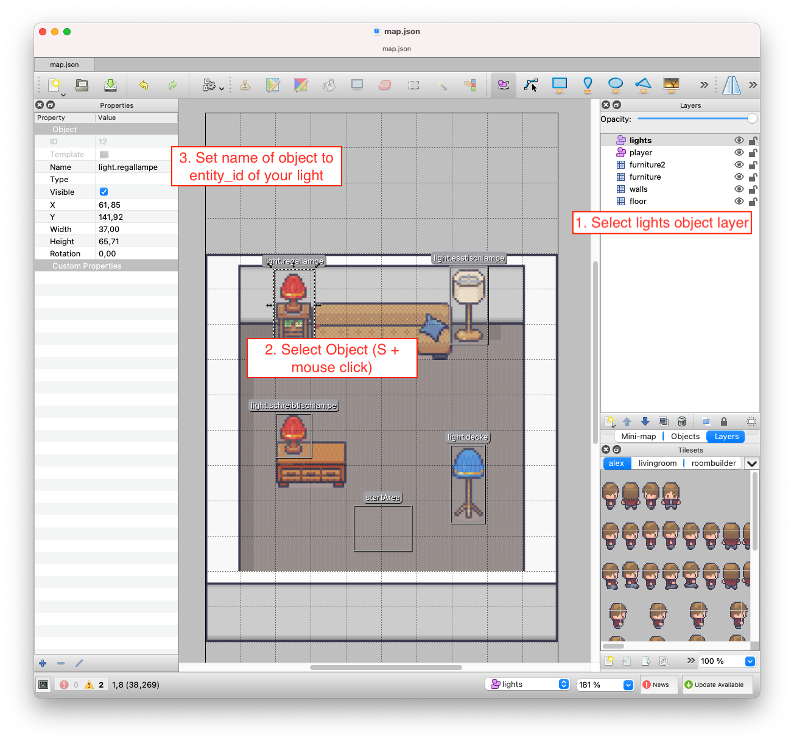

# HomeGame

Proof of concept for controlling your [HomeAssistant](https://home-assistant.io) lights from inside a 2D Browser Game. At the moment lights are toggled when the player reaches a light.


## Running it yourself

### 1. Adjust map to your Light entities

The map is created with a mapeditor called [Tiled](https://www.mapeditor.org/), which allows to create maps an basis of tilesets.

* Open `map.json` in Tiled
* Select lights layer
* Select rectangle object over a lamp (`S` + mouseclick)
* Set name of the objects to entity_id of your lights
* Repeat for all lights
* Save



### 2. Authenticate with HomeAssistant REST API

* Configure CORS for localhost (or the host your running this on)

  ```
  // inside configuration.yaml

  api:

  http:
    cors_allowed_origins: 
      - http://localhost:8000
  ```
* Authentication
  * Generate AuthenticationToken for the REST API (see https://developers.home-assistant.io/docs/api/rest/) and insert it into `config.js` 

### 3. Run local server

* Run server: `python -m SimpleHTTPServer`
* open http://localhost:8000

## Whats next?

For the moment I just wanted to check out how to create a really basic game on basis of a Tiled Map and connect it with HomeAssistant. Ideas for the future:

* Poltergeist - Create a map of a real location and let the user play a ghost which lets flicker lights. I think it could be fun demo for a Meetup or other event at our office.
* Addon creation - Wrap it inside an Addon and make configuration easier, so that everyone just can create a custom map and only needs to upload it and is ready to go.
* Do you have an idea I could do with it? Let me know ... :)